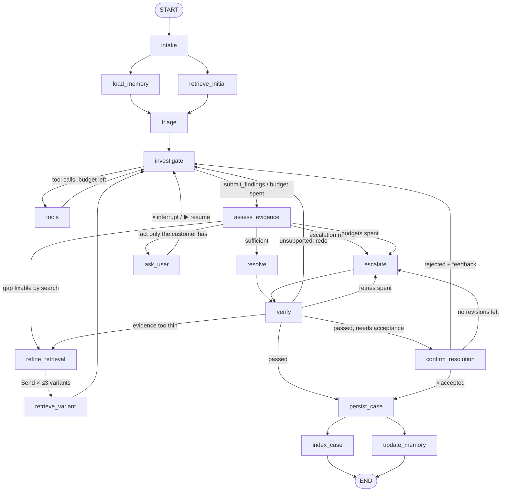

# AutoSupport — Architecture in detail

The [README](README.md) explains what the agent does and how to run it. This document is the
reference behind it: every node, every routing rule, the state and memory design, the retrieval
pipeline with the measurements behind each constant, the output schema and confidence formula,
and the decisions that shaped them.

---

## Contents

1. [Design pattern](#1-design-pattern)
2. [Components](#2-components)
3. [The graph](#3-the-graph)
4. [Evidence rules and routing](#4-evidence-rules-and-routing)
5. [Loops, limits and failure handling](#5-loops-limits-and-failure-handling)
6. [State](#6-state)
7. [Case persistence](#7-case-persistence)
8. [Long-term memory](#8-long-term-memory)
9. [Retrieval (RAG)](#9-retrieval-rag)
10. [Tools and skills](#10-tools-and-skills)
11. [Output, grounding and confidence](#11-output-grounding-and-confidence)
12. [Evaluation](#12-evaluation)
13. [Design choices and their rationale](#13-design-choices-and-their-rationale)

---

## 1. Design pattern

**A deterministic lifecycle wrapped around an agentic core.**

| Layer | Pattern | Why |
|---|---|---|
| Lifecycle: intake → verify → persist → index | Fixed edges | Persisting every ticket, verifying every answer and indexing accepted fixes must *always* happen, so they aren't left to the model |
| Investigation | ReAct tool loop (`investigate` ⇄ `tools`) | The model decides which tools to call and when, within a budget. Nothing is a hard-coded sequence |
| Evidence handling | Corrective RAG | Code grades the evidence and routes to resolve, search again, ask the customer or hand off |
| Pre-commit check | Reflection (`verify`) | Every draft is checked against its cited cases; an unsupported draft loops back |
| Human input | Human-in-the-loop via `interrupt()` | Clarification questions and acceptance of the answer, surviving process exit |

**Rejected alternatives.**
- A single prebuilt ReAct agent can't guarantee persistence, verification or indexing.
- A supervisor with sub-agents adds coordination cost with no gain: there's one domain and one
  ticket at a time.
- Plan-and-execute adds a model call per ticket without changing what gets retrieved.

---

## 2. Components

| Layer | Choice | Why |
|---|---|---|
| Orchestration | LangGraph 1.x | `interrupt()`/resume, checkpointing, `Send` fan-out |
| Checkpointer | `SqliteSaver` → `data/checkpoints.sqlite` | Resume must survive the process exiting between `new` and `resume` |
| Dense index | Chroma, embedded `PersistentClient` → `data/chroma/` | Local, no server, metadata filters |
| Lexical index | SQLite FTS5 (BM25) | Product and system names (`QNAP NAS`, `macOS 15`) separate cases on this templated corpus; embeddings blur them. FTS5 ships in SQLite |
| Structured store | SQLite → `data/autosupport.sqlite` | Cases, customer memory and the dataset mirror; a separate file from checkpoints so either can be wiped alone |
| Embeddings | local `BAAI/bge-small-en-v1.5` | Free, deterministic, offline |
| LLM | `init_chat_model`; default Groq `openai/gpt-oss-120b` for all tiers; Anthropic Claude supported | Provider quirks live only in `llm.py` |
| Interface | Typer CLI over `service.py` | The CLI only renders; `service.py` returns Pydantic objects, ready for a web front end |
| Evals | LangSmith | Datasets, experiments, evaluators |
| Config | `pydantic-settings` reading `.env` | One source of truth; fails fast on missing keys |

**Model calls.** Only four steps call a model; everything deterministic is Python.

| Step | Tier | Job |
|---|---|---|
| `investigate` | main | Multi-case reasoning and tool choice; each round ends with a `submit_findings` tool call |
| `resolve` | fast | Draft the customer reply from cited evidence |
| `verify` (claim check) | fast | Find claims the cited cases don't back, and wording that overclaims the confidence band |
| `update_memory` | fast, gated | Propose durable customer facts; skipped when a regex finds nothing worth remembering |
| `triage`, `assess_evidence`, `refine_retrieval`, `escalate` | — | A label vote, threshold rules, queries built from the hypothesis, a handoff template |
| eval judge | judge | Groundedness; configured separately so changing a tier never changes who grades it |

Every structured call goes through `llm.structured()`: `with_structured_output`, strict on Groq,
and resampled up to 3 times when the provider rejects a malformed generation.

---

## 3. The graph



| # | Node | Does | Reads → writes | Model |
|---|---|---|---|---|
| 1 | `intake` | Writes the open case to SQLite immediately; seeds the conversation | ticket → `status="open"`, `messages` | — |
| 2 | `load_memory` | Loads the customer profile and their earlier tickets | `customer_id` → `customer_profile`, `customer_history` | — |
| 3 | `retrieve_initial` | One broad hybrid search, top 10, no filters | ticket → `retrieved_cases` | — |
| 4 | `triage` | Queue, type, priority and tags by a similarity- and cluster-weighted vote over the neighbours' labels; adds the `escalation` skill when escalation answers dominate or the ticket touches security, outage, data loss or legal | ticket, retrieved → `classification`, `active_skills` | — |
| 5 | `investigate` | ReAct step: hypothesis, tool calls, then `submit_findings` with hypothesis, evidence and stances, approach clusters, missing facts and a clarification question | everything → `findings`, `hypothesis`, `evidence` | main |
| 6 | `tools` | Runs requested tools sequentially; logs them; merges search hits into state with similarity re-anchored to the ticket | last message → `tool_log`, `retrieved_cases` | — |
| 7 | `assess_evidence` | Grades the findings in code: verdict, escalation rules, next action, the question to ask | findings, retrieved → `evidence_assessment`, `pending_question` | — |
| 8 | `refine_retrieval` | Builds up to 3 targeted queries and fans out with `Send` | hypothesis, clarifications → `retrieval_round += 1` | — |
| 9 | `retrieve_variant` | Runs one query variant with its filters | `Send` payload → `retrieved_cases` | — |
| 10 | `ask_user` | `interrupt()` with the question; on resume records the answer | `pending_question` → `clarifications` | — |
| 11 | `resolve` | Drafts the reply; every recommendation cites `[case_id]`; honours remembered preferences and tried fixes | evidence, memory → `draft` | fast |
| 12 | `escalate` | Assembles the handoff from state: target queue, reason, hypothesis, evidence, customer answers, missing facts | state → `draft`, `escalation_trigger` | — |
| 13 | `verify` | Rules G1–G4 on every draft, the claim check on model-written drafts, and confidence | draft → `verification`, `confidence` | fast |
| 14 | `confirm_resolution` | `interrupt()` for the customer to accept, or reject with feedback | draft → `user_acceptance` | — |
| 15 | `persist_case` | Builds and writes the final `CaseResult` | all → `final_output` | — |
| 16 | `index_case` | Makes an accepted resolution retrievable as `agent_resolved` | case row → Chroma, FTS5 | — |
| 17 | `update_memory` | Applies the memory write policy and upserts the profile | ticket, answers → `customers` | fast, gated |

**Parallelism.** `load_memory` ∥ `retrieve_initial` after intake; up to three `retrieve_variant`s
via `Send`; `index_case` ∥ `update_memory` at the end. Every key two branches can write in one
step has a reducer (`retrieved_cases`, `retrieval_queries`, `tool_log`, `messages`, `errors`), so
LangGraph never raises `InvalidUpdateError`.

**Interrupts.** LangGraph re-runs an interrupt node from the top on resume, so `ask_user` and
`confirm_resolution` do nothing before `interrupt()` except read state: no model call, no database
write. The question is written earlier (by `investigate`, filtered by `assess_evidence`), and
`verify` marks the case `awaiting_user` before the pause. Checkpoints are written after every
superstep, so `autosupport resume <id>` in a new process continues the same thread
(`thread_id = "{customer_id}:{ticket_id}"`).

---

## 4. Evidence rules and routing

All in code (`graph/assessment.py`). A case is **relevant** when its cosine similarity to the
*ticket* is ≥ τ = 0.76, whichever query found it. The investigator groups the relevant cases'
historical answers into approach clusters; a cluster **proposes a fix** when at least half its
weight is resolution-class. Clusters of questions or escalations are non-answers, not rival fixes.

| Verdict | Rule |
|---|---|
| **Insufficient** | < 3 relevant cases; or top similarity < τ; or a clarification-led dominant cluster; or no cluster proposes a fix; or < 2 supporting cases in the leading fix cluster; or a blocking missing fact |
| **Conflicting** | ≥ 2 fix clusters with the largest holding < 60% of their weight, or the customer's own history contradicts the usual fix |
| **Sufficient** | Otherwise |

**Next action, in order** (`next_action_for`):
1. **An escalation rule wins outright:**
   - critical priority in a high-stakes area;
   - a dominant cluster that is ≥ 60% escalated;
   - the investigator flagging a person-only action;
   - a customer with ≥ 2 escalations in 90 days.
2. **Sufficient** → resolve.
3. **A gap a better query could close** → refine retrieval, if rounds are left.
4. **A fact only the customer has** → ask. At most 2 facts per question, and never a secret. A
   ticket under 25 words, *counting the customer's answers*, gets one generic question: which
   product, what happens, since when.
5. **Anything else** → escalate.

The code writes its own plain-language reason ("only 1 case(s) support the most common fix; 2
needed") into the handoff, so a person sees which test failed rather than the model's opinion.

**After `verify`** (`verify_destination`):
- **Passed:** a resolution goes to `confirm_resolution` when acceptance is required, otherwise
  to `persist_case`.
- **Failed with retries left:** re-investigate, or re-retrieve when the checker says the
  evidence itself is thin.
- **Failed with retries spent:** a resolution escalates, and an escalation persists, flagged.

---

## 5. Loops, limits and failure handling

| Loop | Counter | Limit | On exhaustion |
|---|---|---|---|
| Tool calls per round (`investigate` ⇄ `tools`) | `tool_calls_this_round` | 6 | → `assess_evidence` |
| Corrective retrieval | `retrieval_round` | 3 (initial + 2) | → ask or escalate |
| Clarification | `clarification_count` | 2 | → escalate |
| Verification retry | `verify_attempts` | 2 | resolution → escalate |
| Customer rejection | `revision_count` | 1 | → escalate |

Counters live in state, limits in `config["configurable"]`, so a resume runs under the limits
the ticket started with. The measured worst case is 69 node executions, under a recursion limit
of 100 that is only a backstop.

**When something goes wrong:**

| Failure | What happens |
|---|---|
| The model returns malformed JSON or a malformed tool call | Resampled up to 3 times |
| The investigator never produces valid findings | The round degrades to "no findings", and the evidence check hands the ticket to a person |
| A tool call raises | Becomes `{"error": ...}` in the conversation and the log; the model carries on |
| One retrieval variant fails | The others still merge; the failure is recorded in `errors` |
| Memory extraction fails | Recorded in `errors`; the ticket, already saved, completes |
| The provider or network fails mid-run | The CLI reports the failing step and error; the ticket stays saved as open, nothing is sent |
| A draft cites a case it never gathered, or contains a placeholder | Rules G1 and G4 reject it; it's redrafted |

---

## 6. State

- **State is working memory; SQLite is the system of record.** Nodes write durable facts to
  SQLite explicitly; the checkpoint is never treated as the database.
- **Lean.** Retrieved cases carry 600-character snippets, and the investigator sees the top 12 at
  300 characters. Full records are one `get_ticket_by_id` call away.
- **Counters in state, one writer each; limits in config.**
- **Shape.** The top-level state is a `TypedDict` with per-key reducers, and sub-objects are
  Pydantic models.

| Group | Keys |
|---|---|
| Identity & input | `ticket_id`, `customer_id`, `thread_id`, `ticket`, `status` |
| Conversation | `messages` (reducer) |
| Memory | `customer_profile`, `customer_history` |
| Triage | `classification`, `active_skills` |
| Retrieval | `retrieved_cases` (dedup reducer, capped at 30), `retrieval_queries` (reducer), `retrieval_round` |
| Investigation | `hypothesis`, `findings`, `evidence`, `evidence_assessment`, `tool_log` (reducer), `tool_calls_this_round` |
| Clarification | `pending_question`, `clarifications` (reducer), `clarification_count` |
| Decision & draft | `decision`, `draft`, `escalation_trigger`, `confidence`, `verification`, `verify_attempts` |
| Acceptance & output | `user_acceptance`, `user_feedback`, `revision_count`, `final_output`, `errors` (reducer) |

Not in state, by design: full historical texts, skill text (only skill *names*), run limits,
embeddings, and profile updates (written straight to `customers`).

---

## 7. Case persistence

- **On arrival.** `intake` inserts the ticket into `cases` as `open` before anything else runs.
- **During the run.** `triage` stores the classification. `verify` and `service.resume_ticket`
  flip the status between `awaiting_user` and `investigating`.
- **At the end.** `persist_case` writes the full `CaseResult` with the final status, `resolved`
  or `escalated`.
- **Ids.** Agent tickets are `T-YYYYMMDD-<6 hex>`; dataset tickets are `HF-<row>`, stable across
  re-ingests.
- **Index policy.** A case becomes retrievable **only if it was resolved and the customer
  accepted it**.
  - Escalated, rejected and unconfirmed outcomes (eval runs) are never indexed, so the agent's
    own unconfirmed answers can't reinforce themselves.
  - What is indexed is the problem text and the accepted resolution, never customer data.
  - `ingest --rebuild` re-indexes accepted agent cases, so nothing learned is lost.

---

## 8. Long-term memory

Two cross-ticket sources, both read by `load_memory` and rendered identically into the
`investigate` and `resolve` prompts: the customer's **profile** (`customers`) and their **own
earlier cases** (`cases`). The historical corpus is anonymous and is never treated as anyone's
history.

**The write policy is code** (`graph/memory.py::apply_update`). The model only proposes an update:

| Rule | |
|---|---|
| **W1 Customer-stated only** | Every item needs a verbatim quote from what the customer wrote (ticket, clarification answers, rejection feedback), or it's dropped |
| **W2 Closed vocabulary** | Facts: product, OS, software version, plan, deployment, integration. Preferences: contact channel, technical level, language. Tried fixes |
| **W3 Discarded** | This incident's error codes, timestamps and order numbers; the fix that worked (already indexed); one-off circumstances; anything secret or contact-PII-like (a regex drops it) |
| **W4 Every outcome** | Escalations update memory too; that's where tried fixes are learned |
| **W5 Merge** | Facts and preferences overwrite by key, with provenance to the ticket that stated them; tried fixes append, deduplicated, capped at 15 |
| **W6 Flags computed** | `repeat_unresolved` = ≥ 2 escalations in 90 days, recounted every write |

A regex gate runs first: with no version number, OS, plan, "already tried" or stated preference
in the customer's text, there's no model call. A question *about* a product ("how do I integrate
Cassandra 4.0?") is correctly not remembered as a fact about the customer.

---

## 9. Retrieval (RAG)

**Ingest** (`autosupport ingest`):
1. `language == "en"` → 28,261 rows. 4,460 exact duplicates (a dataset merge artifact) dropped →
   **23,801 distinct records**; eval tickets held out → **23,795** indexed.
2. **Answer typing.** Sentence-level heuristics label each historical answer `resolution`,
   `clarification_request` or `escalation`. An LLM handles only the ambiguous 10% residue
   (2,400 rows). Result: 12,534 clarification requests, 9,023 escalations, **2,238 resolutions**.
   Blind 200-row precision: 0.839 / 0.885 / 0.840.
3. **Canonicalisation.** Star clustering over a 50-NN graph at cosine **T = 0.92**: every member
   must be close to the *leader*. A guard also requires the same answer class, answer similarity
   ≥ 0.85, and no conflicting named entity. **11,919 canonicals**, each with a `cluster_size`
   that later counts as evidence strength.

| T | Guard | Canonicals | Max cluster |
|---|---|---|---|
| 0.90 | guarded | 11,074 | 39 |
| **0.92** | **guarded** | **12,217** (calibration) / 11,919 (real ingest) | **39** |
| 0.94 | guarded | 13,605 | 28 |

Connected components was rejected: on the same graph it chained 74.6% of the corpus into a few
giant clusters, one with 3,343 records. T = 0.92 sits above the random-pair noise ceiling
(p99.9 = 0.905).

**Query pipeline** (`rag/queries.search`):
1. Dense (Chroma, cosine) and BM25 (FTS5, no stemming, so "NAS" survives), 50 candidates each.
2. **Reciprocal Rank Fusion, k = 10.** At the usual k = 60, a lexical-only hit can never outrank
   anything the dense arm also returns within 50-deep lists. At k = 10, rare-entity matches
   survive into the top 10 64.8% of the time vs 50.3%, with no recall loss.
3. **MMR, λ = 0.7,** over the fused top 30 → final k = 10 (8 per variant). Entity recall 0.335
   vs 0.327 without MMR, recall 0.938 vs 0.945. λ = 0.85 barely swaps results; λ = 0.5 costs four
   times the recall.
4. Similarity is always re-anchored to the ticket.

**Relevance threshold.** τ = 0.76, the random-pair p95 (p50 = 0.585). 93% of real queries still
have 3 cases above it.

**Targeted re-retrieval** (`refine_retrieval`):

| Variant | When | Query |
|---|---|---|
| V1 `clarification_keywords` | The customer has answered a question | Ticket + answer; the answer's entities as exact BM25 phrases |
| V2 `resolution_only` | < 2 relevant resolution cases so far | Ticket, filtered to resolution-class answers |
| V3 `hypothesis_rewrite` | Always | The hypothesis, with its entities as phrases |
| V4 `queue_filtered` | The neighbours disagree on the queue | Ticket, filtered to the classified queue |

---

## 10. Tools and skills

| Tool | Returns | Notes |
|---|---|---|
| `search_similar_tickets(query, k, queue)` | Hits with snippets, class, cluster size, similarity, source | Hits also merge into state |
| `get_ticket_by_id(case_id)` | The full `HF-` or `T-` record | Small-to-big retrieval |
| `get_customer_history(limit)` | This customer's earlier tickets | Customer id bound by closure, never model-supplied |
| `compute_queue_stats(queue)` | Counts by type, priority, answer class | Canonical rows only |
| `escalate_ticket(reason, target_queue)` | Acknowledgement | Advisory; feeds the escalation rules |

Skills are Markdown files in `skills/`, loaded per node, never one giant prompt:
- `investigation.md` is always loaded by `investigate`.
- `escalation.md` is layered on when `triage` flags the ticket as escalation-bound.
- `customer_response.md` is used by `resolve`.

A missing skill file raises rather than silently changing behaviour.

---

## 11. Output, grounding and confidence

`CaseResult` fields:
- **classification** (with the vote's rationale).
- **evidence**, one entry per cited case: id, source, stance, answer class, cluster size,
  similarity, summary.
- **analysis** and **resolution**.
- **escalation**: required, trigger, rule, target queue, reason, handoff.
- **confidence** and its components.
- **verification**, **acceptance**, clarification turns, run stats, errors.

Validators keep it consistent: escalated ⇔ escalation required, accepted ⇒ resolved.

**Grounding rules** (`graph/verification.py`):
- **G1:** every cited id is in the evidence.
- **G2:** a resolution cites a supporting resolution-class case.
- **G3:** every contradicting case is acknowledged in the analysis.
- **G4:** no template placeholders.

**Confidence** (`graph/confidence.py`, computed only in `verify`):

```text
w          = min(1 + log2(cluster_size), 5)          per supporting / contradicting resolution-class case
support    = 1 − exp(−W_supports / 2.5)
agreement  = W_supports / (W_supports + W_contradicts)
relevance  = mean over the top-3 supporters of clamp((sim − 0.76) / (0.92 − 0.76), 0, 1)
value      = support × (0.4 + 0.6·agreement) × (0.7 + 0.3·relevance) − 0.1 per missing fact (max 0.3)
capped at  0.20 no resolution-class support · 0.45 insufficient · 0.60 conflicting · 0.30 verification failed
```

- **Bands:** high ≥ 0.75, medium 0.50–0.74, low < 0.50.
- **Only resolution-class cases count as support:** "these also got escalated" is not a diagnosis.
- **Why this shape:** the terms multiply because support is necessary, and the caps tie the
  number to the verdict.

---

## 12. Evaluation

Five examples, one per behaviour pattern, each scored by five evaluators.

| Evaluator | Kind | Checks |
|---|---|---|
| `pattern_behaviour` | code | Did the agent do what the pattern calls for (outcome, verdict, memory loaded, first ticket retrieved) |
| `retrieval_relevance` | code | Known-good cases in the top 10 |
| `tool_usage_correctness` | code | Only allowed tools, all succeeded, no repeats, no invented ids |
| `classification_accuracy` | code | Queue, type, priority exact; tags by overlap |
| `response_groundedness` | LLM judge | Each claim of a resolution against the full cited cases |

Each example runs as a fresh customer on its own thread. The memory example's first ticket is
accepted to test indexing, then removed from the index afterwards, so an evaluation run leaves the
corpus unchanged.

---

## 13. Design choices and their rationale

| Choice | Rationale |
|---|---|
| Python for triage, evidence grading, query building and the handoff | These are deterministic decisions; code makes them repeatable and testable, and keeps model calls to about four per ticket |
| "Conflicting" means competing fixes | The dataset's queue labels disagree even across near-identical tickets, so label disagreement isn't evidence of conflict |
| Support counted in the leading fix cluster | The investigator sometimes groups escalated leftovers into one large cluster; counting support there would under-count real agreement |
| Placeholder rule G4 | A reply must be sendable as written; template text such as `[Your Name]` or an `example.com` link is caught in code |
| Only accepted resolutions indexed | Indexing unconfirmed answers would let a wrong fix be retrieved as evidence and reinforce itself |
| Star clustering at 0.92 with a guard | Connected components chains unrelated tickets through near-matches (74.6% of the corpus collapsed together) |
| RRF k = 10, MMR λ = 0.7, τ = 0.76 | Measured on the corpus; see §9 |
