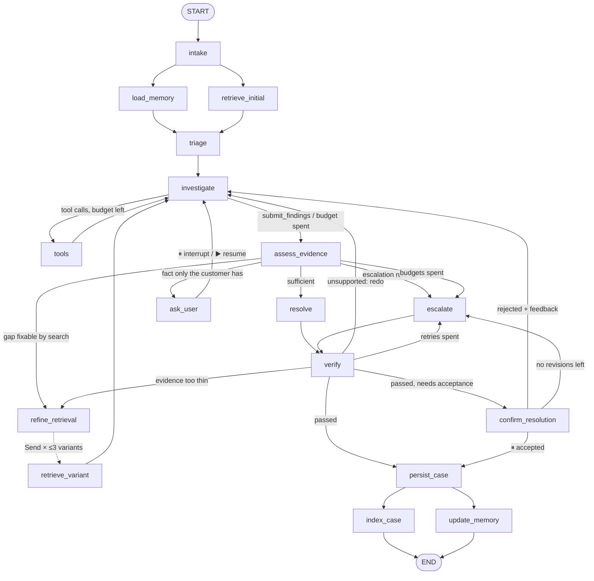

# AutoSupport — Autonomous Support Investigation Agent

A local LangGraph agent that takes a support ticket, investigates it against ~24K historical
tickets with hybrid retrieval and its own tool calls, decides whether it has enough evidence,
asks the customer when it doesn't, checks its own answer, and ends with a grounded resolution
or a clean handoff to a person — then remembers the customer and learns from every accepted
fix.

---

## Stack

| Layer | Choice |
|---|---|
| Language | Python 3.11+ |
| Orchestration | LangGraph 1.x (`StateGraph`, `interrupt()`, `Send`) |
| Checkpointer | `SqliteSaver` → `data/checkpoints.sqlite` |
| Vector store (dense) | Chroma, embedded `PersistentClient` → `data/chroma/` |
| Lexical index (sparse) | SQLite FTS5 (BM25), no BM25 library |
| Structured store | SQLite → `data/autosupport.sqlite` |
| Embeddings | local `sentence-transformers`, `BAAI/bge-small-en-v1.5` |
| LLM | `init_chat_model`, provider set in `.env`. **Default: Groq `openai/gpt-oss-120b`** for both tiers and the eval judge; Anthropic Claude (Sonnet 5 / Haiku 4.5) is a one-line switch |
| Interface | Typer CLI (`autosupport`) over a `service.py` layer |
| Observability + evals | LangSmith |
| Config | `pydantic-settings` reading `.env` |
| Packaging | `pyproject.toml` + `uv.lock`, console script `autosupport` |

The original stack locked Claude as the LLM. Groq was added and made the default after the
evaluation measured it at ~45× lower cost per ticket with a better outcome score
([decisions](docs/project/decisions.md) D18–D22).

---

## Repository layout

```text
autosupport/
├── cli.py            # Typer commands — rendering only
├── service.py        # the only thing the CLI calls; returns Pydantic objects
├── config.py         # every setting and key, validated at startup
├── llm.py            # main / fast / judge models and provider quirks
├── skills.py         # loads skills/*.md
├── graph/            # state, nodes/, routers, build, and the pure logic modules
│                     # (assessment, confidence, verification, memory, evidence, retrieval)
├── tools/            # the five @tool functions
├── rag/              # embedder, dense (Chroma), lexical (FTS5), fusion (RRF + MMR), queries
├── store/            # SQLite repositories
└── ingest/           # load, classify, cluster, index, agent_index
skills/               # investigation.md, escalation.md, customer_response.md
evals/                # held-out examples, evaluators, experiment runner
scripts/demo.py       # the four required demo scenarios
docs/design/          # one design doc per layer (start with architecture.md)
docs/project/         # requirements, build plan, decision record
tests/                # unit + graph tests with stubbed LLMs; no network needed
data/                 # created at runtime, git-ignored
```

---

## Prerequisites

| Need | Why |
|---|---|
| Python 3.11+ and [uv](https://docs.astral.sh/uv/) | Install and run |
| A **Groq** API key on the **Dev tier** (or an Anthropic key) | The LLM. Groq's free tier caps GPT-OSS at 8K tokens/minute, and one investigation call can exceed that on its own |
| A LangSmith API key | `autosupport eval` only. Tracing is **off by default**: the eval and `scripts/smoke_langsmith.py` switch it on for themselves, so normal runs never use trace quota (the free tier allows 5,000/month) |
| Internet on first run | Downloads the Hugging Face dataset and the embedding model; both are cached afterwards |
| ~2 GB disk | Dataset snapshot, embedding model, Chroma index |

---

## Setup

```bash
git clone <repo> && cd AutoSupportInvestigationAgent
uv sync                                  # creates .venv and installs everything
cp .env.example .env                     # then fill in GROQ_API_KEY and LANGSMITH_API_KEY
uv run autosupport ingest --limit 2000   # quick index (a few minutes); drop --limit for all ~24K (~36 min)
uv run autosupport demo                  # the four required scenarios, end to end
```

`.env` and `data/` are git-ignored; `.env.example` lists every variable. Only the providers
your model strings use need a key — config fails at startup, naming the missing variable.

---

## Commands

| Command | What it does |
|---|---|
| `autosupport ingest [--limit N] [--rebuild]` | Dataset → English filter → dedup → classify answers → cluster → SQLite + FTS5 + Chroma |
| `autosupport new --customer C --subject S --body B` | Run a new ticket; prints the result or what it's waiting for |
| `autosupport resume <id> --answer "..."` | Answer a clarification question (works from a fresh process) |
| `autosupport resume <id> --accept` \| `--reject "why"` | Accept or reject a proposed resolution |
| `autosupport show <id>` | The structured result (`CaseResult`) and status |
| `autosupport list [--customer C] [--awaiting]` | Cases, optionally only those paused for the customer |
| `autosupport memory <customer>` | What the agent remembers about a customer, with the ticket each fact came from |
| `autosupport eval [--dataset NAME]` | Offline LangSmith evaluation (15 held-out tickets) |
| `autosupport demo` | Scripted run of the four required scenarios (`scripts/demo.py`) |
| `python scripts/smoke_langsmith.py` | Check LangSmith accepts traces (costs exactly one) |
| `python scripts/smoke_llm.py` | Check every configured model answers |
| `autosupport search "text"` | Inspect hybrid retrieval directly (ranks from each arm, fused score) |

Every command takes `--json` and prints the underlying Pydantic object.

---

## Architecture

A deterministic lifecycle wrapped around an agentic core
([architecture.md](docs/design/architecture.md), [graph-design.md](docs/design/graph-design.md)):

- **The lifecycle is fixed edges.** Every ticket is persisted when it arrives, verified before
  it's final, and persisted and indexed at the end, whatever the model does.
- **The core is a ReAct loop.** `investigate` ⇄ `tools`: the model chooses which of five tools
  to call and when, within a budget, and ends each round by calling `submit_findings`.
- **Corrective RAG around it.** `assess_evidence` grades the findings in Python and routes to
  resolve, search again (up to 3 parallel query variants via `Send`), ask the customer
  (`interrupt()`), or hand off.
- **Two human pauses.** `ask_user` (clarification) and `confirm_resolution` (accept/reject).
  Both survive the process exiting: state is checkpointed to SQLite and `resume` picks it up.
- **Only four steps call a model:** `investigate`, `resolve`, `verify`'s claim check, and
  `update_memory` (only when there's something worth remembering). Classification, evidence
  grading, query rewriting and the escalation handoff are Python (D19). A typical ticket makes
  ~4 LLM calls.
- **Every loop has a counter and a limit, and exhaustion always routes to `escalate`,** so the
  graph terminates. The worst case measured 69 node executions against a recursion limit of 100.

### Graph



---

## State and memory

Three kinds of memory, deliberately separate ([state-schema.md](docs/design/state-schema.md),
[memory-design.md](docs/design/memory-design.md), [case-persistence.md](docs/design/case-persistence.md)):

| | Where | Lifetime | Holds |
|---|---|---|---|
| **Working memory** | LangGraph state, checkpointed per superstep | One ticket (thread `customer:ticket`) | The conversation, retrieved-case *snippets*, findings, counters. Full case text is fetched on demand |
| **System of record** | SQLite `cases` | Permanent | Every ticket, its status, and the final `CaseResult` |
| **Long-term customer memory** | SQLite `customers` | Across tickets | Durable facts, preferences, fixes already tried, flags |

**The memory write policy is code, not a prompt** (rules W1–W6). The model *proposes* facts;
code keeps only items with a verbatim quote from what the *customer* wrote, from a closed set
of keys (product, OS, version, plan, deployment, integration; contact channel, technical level,
language; tried fixes). Code also drops anything secret or contact-PII-like. Facts overwrite
by key, with provenance to the ticket that stated them; tried fixes accumulate; the
`repeat_unresolved` flag is counted, not extracted. Parallel branches only ever write keys
with reducers (`retrieved_cases`, `retrieval_queries`, `tool_log`, `messages`, `errors`).

---

## RAG approach

[rag-design.md](docs/design/rag-design.md) — every number there was measured on the corpus.

- **Ingest.** English rows only; exact duplicates dropped (23,801 distinct records).
  Near-duplicates are **canonicalised**: star clustering at cosine 0.92 with a guard on answer
  class, answer similarity and conflicting entities, giving 11,903 canonicals on a full ingest. Each carries
  `cluster_size`, which counts as evidence strength.
- **Answer typing.** Every historical answer is typed at ingest as `resolution` /
  `clarification_request` / `escalation`, by heuristics first. An LLM runs only on the
  ambiguous ~10% residue, never over the whole corpus.
- **Hybrid retrieval.** Dense (Chroma, cosine) + BM25 (FTS5, no stemming, so product names
  like "NAS" survive) → **Reciprocal Rank Fusion** (k=10) → **MMR** (λ=0.7) for diversity.
  RRF and MMR are written in-repo.
- **Targeted re-retrieval.** Up to three parallel variants: the customer's clarification
  answer, resolution-only, the hypothesis as a query, and queue-filtered.
- **Relevance.** τ = 0.76, the measured random-pair 95th percentile. Similarity is always
  re-anchored to the ticket, whichever query found the case.
- **The corpus grows.** Resolutions the customer **accepts** are indexed as
  `source="agent_resolved"` and retrieved like dataset cases. Escalated, rejected and
  unconfirmed outcomes are never indexed.

---

## Tools and skills

[tools-and-skills.md](docs/design/tools-and-skills.md)

| Tool | For |
|---|---|
| `search_similar_tickets(query, k, queue)` | A targeted search the initial retrieval didn't cover |
| `get_ticket_by_id(case_id)` | The full record behind a snippet (small-to-big) |
| `get_customer_history(limit)` | This customer's earlier tickets (customer bound by closure, never model-supplied) |
| `compute_queue_stats(queue)` | Corpus-wide counts by type, priority and answer class |
| `escalate_ticket(reason, target_queue)` | Flag early that a person is needed; feeds the escalation rules |

Skills are Markdown files loaded per node, never one giant prompt:
- `investigation.md` is always loaded.
- `escalation.md` is layered on when `triage` flags the ticket as escalation-bound.
- `customer_response.md` is used for drafting.

Deleting a skill file fails loudly rather than silently changing behaviour.

---

## Evaluation

`autosupport eval` runs **five real corpus tickets, one per behaviour pattern**, through the
real graph and scores them in LangSmith ([evaluation-design.md](docs/design/evaluation-design.md),
which also documents why each ticket was chosen). This is separate from the in-graph `verify`
node: `verify` gates a single ticket, while the eval scores the system afterwards.

| Pattern | Ticket | Expected behaviour | First run |
|---|---|---|---|
| Clean resolution | HF-9322 (MongoDB integration) | resolves | ✓ resolved |
| Clarification needed | HF-49750 (12-word "engagement drop") | asks one question, pauses | ✓ asked |
| Conflicting evidence | HF-61377 (analytics tools, three different fixes) | verdict `conflicting` | ✗ judged `insufficient` |
| Escalation-worthy | HF-7725 (high priority, Outage tags) | escalates | ✓ escalated |
| Memory + newly resolved | HF-3745 → HF-59267, same customer | remembers, retrieves the first as `agent_resolved` | ✓ both |

Four evaluators are plain code: classification vs the dataset's labels (0.74), tool usage vs an
expected tool set (1.0), retrieval of known-good cases (1.0), and pattern behaviour (0.8). One
LLM judge, groundedness, checks each claim against the full cited cases (0.9 over the two
resolutions). The run cost **7 LangSmith traces**: 5 pipeline runs plus one judge call per
resolved example. Tracing is otherwise off.

An earlier 15-ticket version measured the cost work: $1.91 per run on the original Claude
pipeline versus **$0.07 per run ($0.004 per ticket)** after D18–D22, with ~9 → 4.2 LLM calls per
ticket.

---

## Limitations

- **No customer IDs in the source data.** The historical corpus is anonymous, so customer
  history and long-term memory exist only for tickets created through the agent. The first
  ticket from any customer starts with no memory.
- **`answer_class` is heuristic, with measured, imperfect precision.** Measured on a blind
  200-row sample:

  | Class | Precision | 95% CI |
  |---|---|---|
  | resolution | 0.839 | 0.674–0.929 |
  | clarification_request | 0.885 | 0.782–0.943 |
  | escalation | 0.840 | 0.715–0.917 |

  - The sample was labelled by Claude (blind to the heuristic's guess), not by a human.
  - A mislabelled answer can route a resolvable ticket to "ask" or the reverse.
  - Only ~1 in 8 historical answers is a real resolution, so grounded fixes are scarce by
    nature.
- **Clustering is threshold-based.** 0.92 plus a guard is a judgement call. Tighter would
  understate agreement (`cluster_size` too small); looser would merge distinct cases and
  inflate confidence. The sweep and the argument against the choice are in rag-design §4.
- **Only canonicals are retrievable.** Cluster members are reachable by id but never surface
  from search. That's what stops top-k returning five copies of one case, but the searchable
  index (11,903 canonicals from 23,786 records) is smaller than the corpus. Accepted agent resolutions are *not*
  canonicalised: accepting the same fix repeatedly adds near-identical cases.
- **Single-process SQLite and Chroma.** Both are embedded and assume one writer: fine for a
  local CLI, not for a multi-user service. Evals run sequentially for the same reason.
- **Local embedding quality.** `bge-small-en-v1.5` is free, fast and offline, but weaker than
  large API embeddings, and there is no reranker. The BM25 arm and MMR compensate partly; on a
  heavily templated corpus, same-queue pairs barely outscore random ones.
- **The self-check is model-based.** `verify` combines code rules with an LLM claim check. It
  catches invented citations and overclaiming, but can't prove every sentence is supported.
  With the defaults, the drafter and the checker are the same model, so the separation rests
  on role and prompt rather than a second model.
- **Model variance.** The same ticket can resolve in one run and escalate in the next, and
  single-run eval differences on 15 tickets are noise-sized. The demo passed all four scenarios
  in three consecutive runs only after D22 made its two weakest steps deterministic (citing
  sources, asking on thin tickets). GPT-OSS also sometimes emits malformed tool calls or JSON;
  they're resampled, and a round that still fails escalates instead of crashing.
- **Noisy dataset labels cap classification.** Queue/priority labels disagree even across
  near-identical tickets, so `classification_accuracy` can't approach 1 against them.
- **The brief's example tickets are not in the repo.** The demo and eval use corpus-derived
  tickets; the brief's drop into `scripts/demo.py` and `evals/brief_examples.json`.

---

## Further reading

- [docs/project/decisions.md](docs/project/decisions.md) — every design decision, including
  D18–D22 with before/after measurements.
- [docs/design/](docs/design/) — one document per layer, reconciled with the built system.
