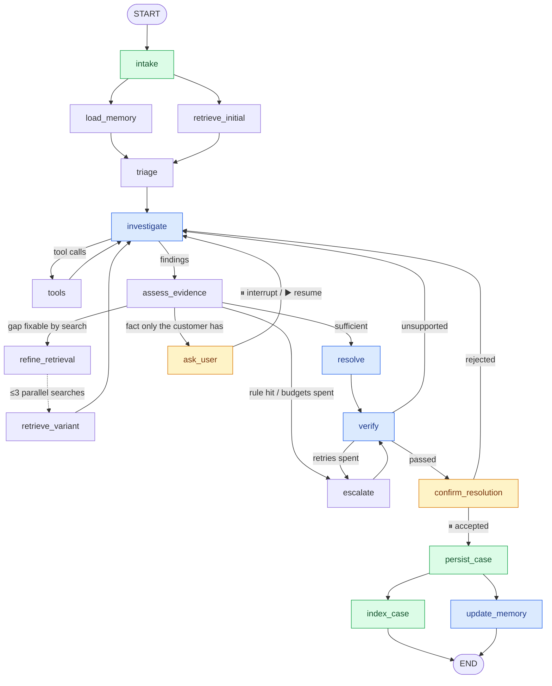

<div align="center">

# 🛠️ AutoSupport

### Autonomous Support Investigation Agent

*Investigates support tickets like a careful engineer: searches past cases, asks when it's
unsure, checks its own answer, and remembers every customer.*


[Features](#-features) · [How it works](#-how-it-works) · [Setup](#-setup) ·
[Commands](#-commands) · [Design](#-design) · [Evaluation](#-evaluation) ·
[Further reading](#-further-reading) · [Example run](#-example-run)

</div>

---

AutoSupport searches **~24,000 historical tickets** for similar cases and decides whether the
evidence is enough. When a fact is missing it **asks the customer**, and before answering it
**verifies its reply** against the cases it cites. Every ticket ends with a **grounded, cited
resolution** or a **clean handoff to a person**. It remembers each customer, and every fix a
customer accepts becomes evidence for the next ticket.

Built with **LangGraph**, hybrid retrieval (**Chroma + SQLite FTS5**), local embeddings and
**Groq GPT-OSS** (Anthropic Claude also supported). Everything runs locally except the model API.

---

## ✨ Features

<table>
<tr>
<td width="50%" valign="top">

#### 🔍 Investigates, not just looks up
- **Agentic.** The model decides which of five tools to call and when; nothing is a fixed
  sequence.
- **Many cases, not the nearest one.** It weighs several historical cases and detects conflict
  or missing evidence.
- **Targeted re-search.** When evidence is thin, it runs up to three focused searches in
  parallel.

#### 💬 Asks, pauses, resumes
- **One focused question** when a fact is missing, then it pauses.
- **Saved to disk:** `resume` continues the same investigation, even from a new process.
- **Customer sign-off:** accept the answer, or reject it with feedback for another look.

#### ✅ Checks itself
- **Self-verification:** every answer is checked against its cited cases before it's final.
- **Citations on every claim** (`[case_id]`), plus a confidence score computed from the
  evidence.

</td>
<td width="50%" valign="top">

#### 🧠 Remembers and learns
- **Case persistence:** every ticket is saved on arrival and tracked from open → resolved or
  escalated.
- **Short-term memory:** the ticket's conversation lives in a checkpointed thread.
- **Long-term memory:** durable customer facts (product, version, plan, preferences, tried
  fixes) carry over.
- **Selective memory:** code rules, not the model, decide what's kept; never secrets or
  guesses.
- **Growing knowledge:** fixes customers accept are indexed and reused as evidence.

#### 🛡️ Never gets stuck
- **Bounded loops:** every loop has a limit and ends in a clean handoff.
- **Graceful failures:** bad model output is retried, and a provider outage never loses a
  ticket.

#### ⚡ Practical
- **Efficient:** about four model calls per ticket; the rest is plain Python.
- **Live CLI:** every step is printed as it runs, ending in a clear result panel.

</td>
</tr>
</table>

---

## 🧭 How it works

| | Step | What happens | Node |
|:-:|---|---|---|
| 1 | **Save** | The ticket is stored as an open case | `intake` |
| 2 | **Remember** | The customer's profile and earlier tickets are loaded | `load_memory` |
| 3 | **Retrieve** | Hybrid search returns the 10 most relevant historical cases | `retrieve_initial` |
| 4 | **Classify** | Queue, type, priority and tags are voted from those cases | `triage` |
| 5 | **Investigate** | The model reasons and calls tools, then submits a hypothesis with cited evidence | `investigate` ⇄ `tools` |
| 6 | **Check evidence** | Enough → answer · fixable gap → search again · missing fact → **ask and pause** · otherwise → hand off | `assess_evidence` |
| 7 | **Answer** | A cited resolution, or a structured escalation | `resolve` / `escalate` |
| 8 | **Verify** | Claims are checked against the cited cases, and confidence is computed | `verify` |
| 9 | **Persist and learn** | The case is saved, an accepted fix is indexed, and memory is updated | `persist_case` → `index_case` ∥ `update_memory` |



<sub>🔵 calls a model · 🟡 pauses for the customer · 🟢 writes to the database · the rest is plain Python</sub>

Every finished ticket produces a structured result with six parts: **Classification** (queue, type,
priority, tags), **Evidence** (the cited historical cases with summaries), **Analysis**,
**Resolution**, **Escalation** (whether it's needed and why) and **Confidence**.

---

## 🚀 Setup

You need [uv](https://docs.astral.sh/uv/) and a **Groq API key on the Dev tier** (an Anthropic
key also works). A LangSmith key is only needed for `autosupport eval`.

```bash
# 1. Install uv
#    Windows:      powershell -ExecutionPolicy ByPass -c "irm https://astral.sh/uv/install.ps1 | iex"
#    macOS/Linux:  curl -LsSf https://astral.sh/uv/install.sh | sh

# 2. Clone and install
git clone https://github.com/nishaankr/AutoSupportInvestigator.git
cd AutoSupportInvestigator
uv sync

# 3. Add your keys: copy the template, then set GROQ_API_KEY in .env
cp .env.example .env                      # Windows: Copy-Item .env.example .env

# 4. Check the model answers
uv run python scripts/smoke_llm.py

# 5. Build the index (downloads the dataset and embedding model on first run)
uv run autosupport ingest --limit 2000    # a few minutes; drop --limit for all 23,795 tickets (~40 min)

# 6. Run
uv run autosupport new                    # prompts for customer id, subject and body
uv run autosupport demo                   # four end-to-end scenarios
```

> [!TIP]
> **If something's off:**
> - **Editor shows imports as unresolved:** select `.venv` as the Python interpreter.
> - **`VIRTUAL_ENV … does not match` warning:** run `deactivate` first.
> - **Wrong model provider is called:** a shell variable overrides `.env`. Check with
>   `env | grep AUTOSUPPORT` (PowerShell: `Get-ChildItem Env:AUTOSUPPORT*`).

<details>
<summary><b>Environment variables</b> (all in <code>.env</code>; keys stay out of git)</summary>

| Variable | Purpose | Default |
|---|---|---|
| `GROQ_API_KEY` | Groq models | required for the default setup |
| `ANTHROPIC_API_KEY` | Claude models | only if a model is set to `anthropic:…` |
| `LANGSMITH_API_KEY` | Evaluation runs | only for `autosupport eval` |
| `LANGSMITH_TRACING` | Trace every run in LangSmith | `false` |
| `AUTOSUPPORT_MAIN_MODEL` | Investigation model | `groq:openai/gpt-oss-120b` |
| `AUTOSUPPORT_FAST_MODEL` | Drafting, verification, memory | `groq:openai/gpt-oss-120b` |
| `AUTOSUPPORT_JUDGE_MODEL` | Evaluation judge | `groq:openai/gpt-oss-120b` |
| `AUTOSUPPORT_EMBED_MODEL` | Local embedding model | `BAAI/bge-small-en-v1.5` |
| `AUTOSUPPORT_DATA_DIR` | Databases and indexes | `./data` |

`.env` and `data/` are git-ignored; only `.env.example`, with empty keys, is committed.

</details>

---

## 💻 Commands

| Command | What it does |
|---|---|
| `autosupport ingest [--limit N] [--rebuild]` | Build the search index from the dataset |
| `autosupport new [--customer C --subject S --body B]` | Run a new ticket live (prompts for anything not passed) |
| `autosupport resume <id> --answer "..."` | Answer a clarification question |
| `autosupport resume <id> --accept` \| `--reject "why"` | Accept or reject a proposed resolution |
| `autosupport show <id>` | Show a ticket's result, or what it's waiting for |
| `autosupport list [--customer C] [--awaiting]` | List cases |
| `autosupport memory <customer>` | What the agent remembers about a customer |
| `autosupport eval` | Run the LangSmith evaluation |
| `autosupport demo` | Run four scenarios end to end: normal resolution, clarification + resume, long-term memory reuse, and retrieval of a newly resolved case |

Prefix each with `uv run`. Every command accepts `--json`.

---

## 🧱 Design

### Architecture

A fixed lifecycle wraps an agentic core:
- **Fixed graph edges** handle what must always happen: save the ticket, verify the answer,
  persist and index the result.
- **A ReAct loop** in the middle, where the model decides what to do.
- **Corrective RAG** routes on the evidence.
- **Reflection** (`verify`) checks every answer.
- **Human-in-the-loop** interrupts handle questions and sign-off.

Only four steps call a model: `investigate`, `resolve`, `verify`'s claim check, and
`update_memory`. Classification, evidence grading, query building and the handoff are Python.

| Layer | Choice |
|---|---|
| Orchestration | LangGraph 1.x with a `SqliteSaver` checkpointer (pauses survive process exit) |
| Retrieval | Chroma (dense) + SQLite FTS5 (BM25), fused with Reciprocal Rank Fusion, diversified with MMR |
| Storage | SQLite for cases, customer memory and the dataset |
| Embeddings | Local `BAAI/bge-small-en-v1.5` |
| LLM | Groq `openai/gpt-oss-120b` by default; Anthropic Claude via `.env` |
| Interface | Typer CLI over a `service.py` layer that returns Pydantic objects |
| Evaluation | LangSmith |

### State and memory

| Kind | Where | Holds |
|---|---|---|
| ⏱️ Short-term | LangGraph state, checkpointed per step | One ticket's conversation, evidence snippets, findings and counters |
| 📁 Case records | SQLite `cases` | Every ticket from arrival to final result |
| 🧠 Long-term | SQLite `customers` | Durable facts, preferences, tried fixes, flags |

**State design.**
- **Typed state.** The graph state is a typed `AgentState` holding identity, conversation,
  memory, classification, retrieved cases, findings, evidence, draft, verification and counters.
- **Working memory, not the record.** It holds only what the current ticket needs: cases
  carry short snippets, and full records are one tool call away. SQLite is the system of record.
- **Safe parallel writes.** Keys written by parallel steps have merge reducers.
- **Counters and limits.** Loop counters live in state and their limits in config.
- **Durable pauses.** State is checkpointed after every step, so a pause survives the process
  ending.

The model only *proposes* what to remember. Code keeps an item only if the customer said it in
their own words, it's a durable kind of fact, and it isn't sensitive.

### Retrieval

- **Corpus.** The English subset of `Tobi-Bueck/customer-support-tickets` is the only knowledge
  source.
- **Answer types.** Every historical answer is labelled at ingest as a resolution, a
  clarification request or an escalation.
- **Canonicals.** Near-duplicates collapse into one canonical case whose `cluster_size` counts
  as evidence strength: **11,919 searchable cases**.
- **Hybrid search.** Dense and keyword search are fused (RRF k=10) and diversified (MMR λ=0.7).
- **Metadata.** Queue, type, priority, tags and answer type drive the classification vote and
  filter the follow-up searches.
- **Comparing evidence.** The relevant cases are grouped by the fix they propose, and code judges
  the evidence **sufficient**, **conflicting** (competing fixes, none dominant) or
  **insufficient**. The agent never copies the nearest ticket's answer.
- **Grounding.** Answers must cite supporting cases; accepted agent resolutions join the index.

### Tools and skills

| Tool | The model uses it to… |
|---|---|
| `search_similar_tickets` | search again with different wording or a queue filter |
| `get_ticket_by_id` | read a full historical case |
| `get_customer_history` | see this customer's earlier tickets |
| `compute_queue_stats` | see how common this kind of ticket is and how it's usually answered |
| `escalate_ticket` | flag early that a person is needed |

**Skills** are instruction files in `skills/`, loaded per step:
- `investigation.md`: always loaded.
- `escalation.md`: added for tickets that look escalation-bound.
- `customer_response.md`: used for drafting.

### Reliability

- **Bounded loops:** tool calls (6 per round), retrieval rounds (3), questions (2), verification
  attempts (2) and customer rejections (1) all have limits, and running out ends in a handoff.
- **Recoverable errors:** malformed model output is retried, and a failing tool becomes an error
  message the model works around.
- **No lost tickets:** memory errors never fail a ticket, and a provider outage stops with a
  clear message while the ticket stays saved.

> [!NOTE]
> Every node, routing rule, measurement and formula is documented in
> **[ARCHITECTURE.md](ARCHITECTURE.md)**.

---

## 📊 Evaluation

`autosupport eval` runs five examples, one per behaviour pattern, through the real graph in
LangSmith. Latest results on the full index:

| Evaluator | Score | Notes |
|---|:-:|---|
| Pattern behaviour | **0.80** | Resolved, asked, escalated and remembered correctly; missed the conflicting-evidence pattern |
| Retrieval relevance | **1.00** | Known-good cases in the top 10, including a newly resolved agent case |
| Tool usage | **1.00** | Only allowed tools, all successful, no repeats |
| Groundedness (LLM judge) | **0.75** | One of three replies added detail its cases didn't contain |
| Classification | **0.63** | Held down by inconsistent queue labels in the dataset |

---

## 🚧 Limitations

- **It only knows customers it has met.** The historical tickets are anonymous, so everyone's
  first ticket starts with a blank slate.
- **Its labels are sometimes wrong.** Whether a past answer was a fix, a question or a handoff is
  worked out by rules that are right about 84–89% of the time, so it occasionally asks when it
  could have answered, or the other way round.
- **"Near-duplicate" is a judgement call.** A tighter cut-off underrates how often a fix has
  worked; a looser one lumps different problems together.
- **It doesn't group its own answers.** Accept the same fix many times and the index gains
  near-copies of it.
- **One user at a time.** The local databases suit a CLI, not many concurrent users.
- **Modest search quality.** A small offline embedding model and no re-ranker.
- **Its self-check can be too forgiving.** It catches invented case numbers and placeholders, but
  can pass reasonable-sounding detail its sources never said.
- **Answers can vary between runs.** The same ticket may be resolved once and handed off the next
  time; the limits keep it safe, not identical.
- **It rarely spots genuine disagreement.** The dataset has few truly competing fixes.

---

## 🔮 Next improvements

- 🔐 **Prompt-injection defence.** Ticket text and retrieved historical tickets reach the model
  unchecked. Next: detect instruction-like content, mark untrusted text in prompts, and add
  injection cases to the evaluation. (Today the damage is limited: the tools are read-only, the
  customer id is fixed by code, and memory writes need the customer's own words.)
- 🧪 **Poisoning safeguards.** False customer "facts" or a wrong accepted fix could mislead later
  tickets. Add review, expiry or trust scores.
- 🔑 **Output and access safety.** Scan replies for personal data, and add authentication with
  per-customer isolation.
- 🎯 **Answer quality.** A separate, stronger model for verification; a re-ranker; de-duplicating
  the agent's own resolutions; a larger evaluation set.
- 🌐 **Product.** A web interface on the existing service layer; Postgres for concurrent users.

---

## 📂 Project structure

```text
autosupport/        cli.py, service.py, config.py, llm.py
├── graph/          state, nodes, routing, and the evidence, confidence and memory logic
├── rag/            embeddings, Chroma, FTS5, fusion
├── tools/          the five tools
├── store/          SQLite repositories
└── ingest/         dataset loading, answer labelling, clustering, indexing
skills/             the three skill files
evals/              evaluation dataset, evaluators, runner
scripts/            demo and smoke tests
tests/              114 tests with stubbed models (uv run pytest)
ARCHITECTURE.md     detailed design reference
```

---

## 📚 Further reading

| Where | What you'll find |
|---|---|
| [ARCHITECTURE.md](ARCHITECTURE.md) | Every node and routing rule, the evidence verdicts, loop limits and failure handling, state and memory design, retrieval measurements, the confidence formula |
| [`skills/`](skills/) | The three instruction files the agent loads while it works |
| [`evals/`](evals/) | The evaluation examples, why each was chosen, and the five evaluators |
| [`scripts/demo.py`](scripts/demo.py) | The four end-to-end demo scenarios |
| [`tests/`](tests/) | 114 tests covering the graph paths, evidence rules, memory policy and retrieval |

---

## 🎬 Example run

One customer, two tickets (real output, trimmed).

**① Ticket 1:** the self-check catches an unsupported claim, then the agent pauses for sign-off.

<details open>
<summary><b>Show output</b></summary>

```text
$ uv run autosupport new
Customer ID: C-7342
Subject: API integration options for our project management platform
Body: We're on the enterprise plan and run our services on AWS with Node.js 18. [...] What
      integration options are available and where is the documentation? We prefer email updates.

[1/9] Persisting ticket as open case ................... done (T-20260925-f35b4c)
[2/9] Loading customer memory + short-term state ....... done (new thread; no prior history for this customer)
[3/9] Retrieving historical cases ...................... 10 cases, 5 relevant (top sim 0.88)
[4/9] Classifying against historical evidence .......... Technical Support / Request / high
[5/9] Investigating with tools + skills ................ calling get_ticket_by_id
[6/9] Checking evidence sufficiency .................... sufficient, proceeding to resolution
[7/9] Generating resolution ............................ done, cites HF-14977, HF-28545
[8/9] Verifying against evidence ....................... not supported (attempt 1): To receive updates via email...
[5/9] Investigating with tools + skills ................ calling search_similar_tickets
[7/9] Generating resolution ............................ done, cites HF-14977, HF-28545
[8/9] Verifying against evidence ....................... supported (attempt 2), confidence 0.85 (high)

PAUSED: proposed resolution, waiting for the customer to accept or reject it.
  autosupport resume T-20260925-f35b4c --accept
```

</details>

**② Sign-off:** the customer accepts in a new process; the answer is saved, indexed and remembered.

<details>
<summary><b>Show output</b></summary>

```text
$ uv run autosupport resume T-20260925-f35b4c --accept
[9/9] Persisting final case + indexing for retrieval ... saved as resolved
      -> customer memory now: plan=enterprise, deployment=AWS, integration=API, contact_channel=email
      -> indexed for future retrieval as source=agent_resolved

========================= CASE RESULT  T-20260925-f35b4c =========================
Classification   Queue: Technical Support | Type: Request | Priority: high
Evidence         [HF-14977] source=dataset | supports | resolution | cluster_size=8 | sim 0.88
                 [HF-28545] source=dataset | supports | resolution | cluster_size=3 | sim 0.87
Analysis         [...] No case mentions configuring email notifications, so that detail is omitted.
Resolution       We support REST APIs [...] documented in our developer portal. [HF-14977] [HF-28545]
Escalation       Not required
Confidence       0.85 (high)
```

</details>

**③ Ticket 2:** the same customer follows up without repeating their details.

<details>
<summary><b>Show output</b></summary>

```text
$ uv run autosupport new
[2/9] Loading customer memory + short-term state ....... done (remembered plan=enterprise, deployment=AWS,
      integration=API; prefers contact_channel=email; earlier tickets: T-20260925-f35b4c (resolved))
[3/9] Retrieving historical cases ...................... 10 cases, 5 relevant; includes
      T-20260925-f35b4c source=agent_resolved sim 0.85
[7/9] Generating resolution ............................ done, cites HF-14977, HF-12085, T-20260925-f35b4c
```

</details>

> [!NOTE]
> **What this shows:**
> - **Self-verification:** the first draft claimed an email feature no case mentions, and the
>   check sent it back before the customer saw it.
> - **Memory:** ticket 2 loaded the customer's details from ticket 1.
> - **Growing knowledge:** ticket 1's accepted answer was retrieved and cited as evidence.
