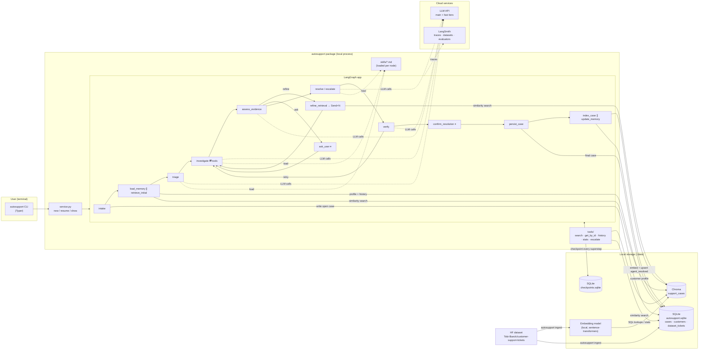

# Architecture — System Overview

> **Status:** Draft v1 · the system-level decisions that every other doc builds on.
> **Downstream docs:** `graph-design.md` (topology), `state-schema.md` (graph state), `rag-design.md`, `tools-and-skills.md`, `memory-design.md`, `case-persistence.md`, `evaluation-design.md`, `output-schema.md`.

---

## 1. Decisions at a glance

| Concern | Decision | One-line reason |
|---|---|---|
| Orchestration | **LangGraph 1.x** (Python 3.11+) | Mandated. Provides interrupt/resume, checkpointing and `Send`-based parallelism. |
| Vector DB (dense half) | **Chroma** (embedded `PersistentClient`, on-disk) | Local, needs no server, supports metadata filtering, and is plenty for about 28K docs plus growth |
| Lexical index (sparse half) | **SQLite FTS5** virtual table over `dataset_tickets` | Hybrid retrieval needs BM25, which Chroma has no notion of. FTS5 ships inside SQLite, so this adds no dependency and reuses a store we already have. |
| Retrieval strategy | **Hybrid dense + BM25, fused with RRF**, then MMR for diversity | The corpus is synthetic and heavily templated, so shared boilerplate flattens dense scores. The discriminating signal is product and system entities (`QNAP NAS`, `macOS 15`, `Aruba 2530`), which BM25 captures and embeddings blur. Detail in `rag-design.md`. |
| Duplicate handling | **Canonicalisation with frequency counts** at ingest | Near-duplicate clusters collapse to one canonical case carrying `cluster_size`, turning a data liability into an evidence-strength signal that feeds confidence and weights conflict detection. |
| Historical answer typing | **`answer_class`** (`resolution` / `clarification_request` / `escalation`) assigned at ingest | A large share of dataset answers are requests for more information, not resolutions. Grounding on them blindly produces useless output; knowing which is which drives the clarification route. |
| Structured DB | **SQLite** (`data/autosupport.sqlite`) | Local, file-based and transactional. It holds the open and resolved cases and customer memory. |
| Checkpointer | **`SqliteSaver`** (`data/checkpoints.sqlite`) | Resuming has to survive the CLI process exiting (see `state-schema.md` §4) |
| Embeddings | **Local sentence-transformers model** (default `BAAI/bge-small-en-v1.5`) | Free, deterministic and offline, and ingestion costs no API spend. Detail is in `rag-design.md`. |
| LLM: main reasoning | **Cloud model, "main" tier** (default `anthropic:claude-sonnet-5`) | Handles investigation, resolution and escalation drafting, where quality matters |
| LLM: cheap sub-steps | **Cloud model, "fast" tier** (default `anthropic:claude-haiku-4-5`) | Handles triage, evidence grading, query rewriting, verification and memory extraction, which are high-volume, structured-output steps |
| LLM abstraction | `langchain.chat_models.init_chat_model(...)` | The provider and model are env-configurable, so switching to OpenAI or another provider is a config change, not a code change |
| Interface | **CLI (Typer)** | The brief says a CLI or API is enough. A CLI shows interrupt/resume across separate commands most clearly, with no server to run. |
| Observability & evals | **LangSmith** (tracing + datasets + evaluators) | Mandated for evals. Tracing comes for free through env vars. |
| Config & secrets | `.env` (git-ignored) + `.env.example` (committed) via `pydantic-settings` | "Keep secrets/API keys outside source control" |
| Packaging | `pyproject.toml` (installable with `uv` or `pip`), console script `autosupport` | One install command and one entry point |

---

## 2. Component rationale

### 2.1 Vector DB (dense half): Chroma
| Option | Verdict | Why |
|---|---|---|
| **Chroma** | ✅ | Runs in-process with on-disk persistence. Supports `where` metadata filters (queue, type, priority, source) and incremental `upsert`, which is needed to index newly resolved cases. LangChain integration is available (`langchain-chroma`). |
| FAISS | ❌ | Has no native metadata filtering or document store, so we would have to rebuild both, and upserting single new cases is awkward. |
| Qdrant | ◐ | Excellent filtering, but local mode adds weight and the server mode needs Docker. That's infrastructure the brief says not to prioritise. |
| Pinecone | ❌ | Cloud-only, while "run locally" is a core constraint. It would also add another API key. |

**Collections:** a single collection `support_cases`. Dataset tickets (`source="dataset"`) and agent-resolved cases (`source="agent_resolved"`) live side by side and are told apart by metadata. Retrieval can then weight or filter by source without querying two collections.

**Tags caveat:** Chroma metadata values must be scalars, so tags are stored in two forms. There's a joined string for display, and one boolean key per tag (for example `tag_billing: true`) so tags can be filtered on. The detail is in `rag-design.md`.

**Cluster and answer metadata:** every indexed document also carries `cluster_size` (int) and `answer_class` (str), both produced at ingest (§4.1). Only cluster canonicals are embedded and indexed; members are kept in SQLite and reachable through `canonical_of`. `assess_evidence` reads both: cluster size weights evidence strength and conflict severity, and a neighbourhood dominated by `answer_class="clarification_request"` is the strongest available signal to route to `ask_user` rather than `resolve`.

### 2.1b Lexical index (sparse half): SQLite FTS5

Hybrid retrieval needs a BM25 side, and Chroma provides none.

| Option | Verdict | Why |
|---|---|---|
| **SQLite FTS5** | ✅ | Ships inside SQLite, so no new dependency and no new store. Indexes the same rows `get_ticket_by_id` and `compute_queue_stats` already read. `bm25()` is built in, and the index is rebuilt incrementally as resolved cases are added. |
| `rank_bm25` (in-memory) | ❌ | Another dependency that wraps what FTS5 already does, and it would hold a second copy of the corpus in RAM with no persistence. |
| Chroma alone (dense only) | ❌ | Templated synthetic prose collapses dense similarity; entity terms are exactly what gets lost. |

**Implementation:** a **standalone** (non-external-content) virtual table `dataset_tickets_fts` over `subject`, `body`, `answer` and the joined tag string (all index text, normalised per `rag-design.md` §2), plus `case_id`, `source`, `queue`, `type`, `answer_class` as `UNINDEXED` filter columns — external-content FTS5 can only back one table, and rows come from both `dataset_tickets` and, from CP6, `cases`, so a plain populated-on-write table is the workable shape. Tokenizer is `unicode61 remove_diacritics 2`, deliberately **without Porter stemming** — Porter mangles the entity tokens this arm exists to preserve ("NAS" stems to `na`). Both retrieval arms return ranked ID lists, which are fused with **Reciprocal Rank Fusion** in `autosupport/rag/fusion.py` — roughly forty lines, written in-repo rather than pulled from a library, so the ranking is fully inspectable. Query construction, `k`, the RRF constant and MMR are specified, with measured justification, in `rag-design.md`.

### 2.2 Structured DB: SQLite
| Option | Verdict | Why |
|---|---|---|
| **SQLite** | ✅ | Zero setup, a single file, ACID writes, and SQL makes `compute_queue_stats` and customer-history queries trivial. It's in the Python standard library. |
| Postgres | ❌ | Needs a server, which is infrastructure the brief discourages. We have no concurrency need. |
| Plain JSON | ❌ | Isn't transactional, has no queries and doesn't support concurrent writers. It would also be painful for the statistics tools. |

**Tables** (full schemas in `case-persistence.md` and `memory-design.md`):
- `cases`: every ticket seen by the agent, covering open, awaiting_user, resolved and escalated. It stores classification, final output JSON, `thread_id`, `indexed_at` and timestamps.
- `customers`: the long-term memory profile for each `customer_id`.
- `dataset_tickets`: a read-only mirror of the ingested HF rows (`HF-<row>`, keyed to the row's position in the *unfiltered* HF split — `rag-design.md` §1). It lets `get_ticket_by_id` and `compute_queue_stats` run as SQL without going through the vector store. Beyond the source columns it carries both display text (raw) and index text (normalised — `rag-design.md` §2) for `subject`/`body`/`answer`, plus the ingest-time fields `answer_class`, `answer_class_source`, `below_content_threshold`, `is_canonical`, `canonical_of` and `cluster_size` (set on canonical rows only).
- `dataset_tickets_fts`: an FTS5 virtual table over the searchable text of the above, providing the BM25 arm of hybrid retrieval (§2.1b).

Access is through plain `sqlite3` behind a thin repository module (`autosupport/store/`). An ORM would be overkill for three tables.

### 2.3 LLM tiering

| Node(s) | Tier | Why |
|---|---|---|
| `investigate`, `resolve`, `escalate` | **main** | Multi-case reasoning, tool selection and grounded drafting |
| `triage`, `assess_evidence`, `refine_retrieval`, `verify`, `update_memory` | **fast** | Structured output against a fixed schema. These run often, and some run once per loop iteration. |

- Both tiers are resolved from `.env`: `AUTOSUPPORT_MAIN_MODEL` and `AUTOSUPPORT_FAST_MODEL` (format `provider:model`).
- Every structured step uses `.with_structured_output(PydanticModel)`, so outputs are validated rather than parsed from free text.
- `verify` deliberately uses a **different tier** from the drafter, so the output isn't grading itself with the same model. It's a cheap, partial guard against self-agreement.
- Temperature is 0 for the fast tier. **No temperature is set for the main tier**: Claude
  Sonnet 5, the default main-tier model, rejects `temperature` outright (400,
  "temperature is deprecated for this model") — current-generation Claude models above
  the Haiku tier removed sampling controls in favour of adaptive thinking/effort. If the
  main tier is ever pointed at an older model that still accepts `temperature`, that
  model runs at its own default rather than a value this codebase sets.

### 2.4 Interface: CLI
| Command | Does |
|---|---|
| `autosupport ingest [--limit N] [--rebuild]` | Download the HF dataset → filter to English → load `dataset_tickets` → embed → upsert into Chroma |
| `autosupport new --customer C --subject S --body B` | Start a new ticket and a new thread. Prints either the final result or the pending interrupt. |
| `autosupport resume <ticket_id> --answer "..."` | Answer a clarification question |
| `autosupport resume <ticket_id> --accept` \| `--reject "feedback"` | Accept or reject a proposed resolution |
| `autosupport show <ticket_id>` | Print the structured `CaseResult` and the case status |
| `autosupport list [--customer C] [--awaiting]` | List cases |
| `autosupport memory <customer_id>` | Print the stored long-term memory for a customer |
| `autosupport eval [--dataset NAME]` | Run the LangSmith evaluation suite |
| `autosupport demo` | Scripted run of the four required demo scenarios end-to-end |

**Why not an API:** a FastAPI layer would add a server, schemas and a client for the demo without showing any more agent behaviour. The CLI commands call a thin `service.py` layer, not the graph directly. An API could wrap that same layer later with no graph changes.

---

## 3. End-to-end diagram



---

## 4. Request lifecycle (how the pieces talk)

1. **Ingest (once):** `autosupport ingest` runs seven stages. Full parameters, all measured against the real dataset, are in `rag-design.md`; this is the contract between them.
   1. **Load and filter.** Pull the Hugging Face dataset, keep `language == "en"`, snapshot to local parquet so later runs are offline and reproducible. Each row gets the deterministic ID `HF-<row_index>`, where `row_index` is the row's position in the *unfiltered* HF split.
   2. **Exact-duplicate dedup.** Drop rows that are byte-identical (after normalisation) to another row — a dataset-generation merge artifact where a `version=None` row and a `version=400` row carry the same subject/body/answer. Keep the labelled-version copy. Without this stage `cluster_size` would silently double-count some records.
   3. **Classify answers.** Assign `answer_class` ∈ {`resolution`, `clarification_request`, `escalation`}. Sentence-level heuristic and regex first pass, precision measured against a hand-labelled sample of 200, and an LLM applied only to the ambiguous residue (~8–10% of rows). This deliberately avoids 28K model calls; the sampled precision figure is reported in the README as measured methodology rather than asserted.
   4. **Cluster and canonicalise.** Star (leader) clustering, not connected components — connected components was measured to collapse the corpus into a handful of giant clusters via transitive chaining. A candidate joins a leader only when similarity clears the threshold *and* a guard holds (matching `answer_class`, answer-text similarity, no conflicting named entity). Every row records `cluster_size` (canonicals only), `is_canonical` and `canonical_of`.
   5. **Write SQLite.** All rows land in `dataset_tickets`, canonicals and members alike, so a member is still reachable by ID.
   6. **Build the lexical index.** Populate `dataset_tickets_fts` (§2.1b) from canonicals only — the same set Chroma holds, so RRF never double-counts a near-duplicate the clustering stage already collapsed.
   7. **Embed and upsert.** Only canonicals are embedded. Embed text is `subject + body` (index text) — the answer is deliberately excluded, and metadata (queue, type, priority, `answer_class`, `cluster_size`, tags) is never concatenated into it, only attached as Chroma metadata.
2. **New ticket:** the CLI calls `service.new_ticket()`, which builds `thread_id = "{customer_id}:{ticket_id}"` and invokes the graph with the SQLite checkpointer.
3. **Graph run:**
   - `intake` writes the `cases` row (`status=open`) immediately.
   - Memory is loaded from SQLite at the same time as the first retrieval from Chroma.
   - The LLM steps call the cloud model. Tools read from Chroma and SQLite.
   - Every superstep is checkpointed to `checkpoints.sqlite`.
4. **Interrupt:** the graph returns the interrupt payload and the CLI prints it and exits. The case row reads `awaiting_user`.
5. **Resume:** `autosupport resume <ticket_id>` looks up the thread in `cases.thread_id` and calls `graph.invoke(Command(resume=...), config)`. Execution continues from the checkpoint.
6. **Finalise:**
   - `persist_case` writes the final `CaseResult` to `cases`.
   - `index_case` embeds the accepted resolution and upserts it into Chroma as `source="agent_resolved"`, which makes it retrievable by the very next ticket.
   - `update_memory` upserts the customer profile.
7. **Observe:** every run is traced in LangSmith, tagged with `thread_id`, `ticket_id` and `customer_id`. `autosupport eval` runs the same graph against LangSmith datasets.

**Offline / online boundary:** embedding, both databases and the checkpoints are local. Only LLM calls and LangSmith telemetry leave the machine. LangSmith tracing can be turned off (`LANGSMITH_TRACING=false`) without affecting agent behaviour.

---

## 5. Repository layout

```text
AutoSupport/
├── pyproject.toml
├── .env.example                  # keys + model names, no secrets
├── .gitignore                    # .env, data/, __pycache__, .venv
├── README.md
├── docs/                         # these design docs
├── skills/                       # investigation.md, escalation.md, customer_response.md
├── autosupport/
│   ├── cli.py                    # Typer commands
│   ├── service.py                # new_ticket / resume / show — the only thing the CLI calls
│   ├── config.py                 # pydantic-settings: models, paths, limits, thresholds
│   ├── llm.py                    # init_chat_model for main + fast tiers
│   ├── graph/
│   │   ├── state.py              # AgentState + sub-models (state-schema.md)
│   │   ├── nodes/                # one module per node
│   │   ├── routers.py            # conditional-edge functions
│   │   ├── confidence.py         # compute_confidence() — the scale's single definition (output-schema.md §4)
│   │   └── build.py              # StateGraph wiring + compile(checkpointer)
│   ├── tools/                    # @tool definitions
│   ├── skills.py                 # skill loader
│   ├── rag/
│   │   ├── embedder.py           # local sentence-transformers wrapper
│   │   ├── dense.py              # chroma client + similarity search
│   │   ├── lexical.py            # FTS5 BM25 search
│   │   ├── fusion.py             # reciprocal rank fusion + MMR
│   │   └── queries.py            # query construction + metadata filters
│   ├── store/                    # sqlite repositories: cases, customers, dataset_tickets
│   └── ingest/
│       ├── load.py               # HF → filtered English parquet snapshot
│       ├── classify.py           # answer_class heuristics + LLM residue pass
│       ├── cluster.py            # near-duplicate clustering + canonicalisation
│       └── index.py              # sqlite write, FTS5 build, chroma upsert
├── evals/                        # LangSmith dataset builders + evaluators
├── scripts/demo.py               # the four required demo scenarios
├── tests/
└── data/                         # created at runtime; git-ignored
    ├── chroma/
    ├── autosupport.sqlite
    └── checkpoints.sqlite
```

---

## 6. Dependencies (initial)

| Package | Purpose |
|---|---|
| `langgraph`, `langgraph-checkpoint-sqlite` | Orchestration + persistent checkpoints |
| `langchain`, `langchain-core`, `langchain-anthropic` (+ optional `langchain-openai`) | Model abstraction, tools, messages |
| `langchain-chroma`, `chromadb` | Vector store |
| `sentence-transformers` | Local embeddings |
| `datasets` | Loading the HF dataset |
| `langsmith` | Tracing, datasets, evaluators |
| `pydantic`, `pydantic-settings` | Schemas and config |
| `typer`, `rich` | CLI and readable terminal output |
| `pytest` | Tests |

Exact versions will be pinned in `pyproject.toml` once the first working build is done.

**No dependency is added for hybrid retrieval.** BM25 comes from SQLite's built-in FTS5, and RRF and MMR are written in-repo. A BM25 library would wrap what the standard library already provides, and an opaque retriever class would be harder to explain than forty lines of ranking code.

---

## 7. Configuration & secrets

`.env.example` (committed):
```dotenv
ANTHROPIC_API_KEY=
# OPENAI_API_KEY=
LANGSMITH_API_KEY=
LANGSMITH_TRACING=true
LANGSMITH_PROJECT=autosupport

AUTOSUPPORT_MAIN_MODEL=anthropic:claude-sonnet-5
AUTOSUPPORT_FAST_MODEL=anthropic:claude-haiku-4-5
AUTOSUPPORT_EMBED_MODEL=BAAI/bge-small-en-v1.5
AUTOSUPPORT_DATA_DIR=./data
```
- `.env` is git-ignored, and so is `data/`, which holds user tickets and customer memory.
- Run limits and thresholds (`graph-design.md` §9) live in `config.py` as defaults and can be overridden by env vars or passed per run in `config["configurable"]`.

---

## 8. Known trade-offs (early input to README "Limitations")
- **Single process, single user.** Neither SQLite nor embedded Chroma is built for many concurrent writers. That's fine for a local CLI, but the stores would need replacing for multi-user service.
- **Local embedding quality vs. API embeddings.** A small local model trades some retrieval quality for zero cost and offline ingestion. `rag-design.md` covers reranking to recover precision.
- **The dataset has no customer IDs.** Customer history and long-term memory apply only to tickets created through the agent, not to the historical corpus.
- **The self-check is model-based.** `verify` uses an LLM with rule checks. It reduces unsupported claims but can't guarantee there are none.
- **`answer_class` is heuristic, not ground truth.** The labels come from sentence-level pattern matching validated against a 200-row sample, with an LLM only on ambiguous residue (~8–10% of rows). Measured precision (`rag-design.md` §5.4): resolution 0.839, escalation 0.840, clarification_request 0.885 — clarification clears the 0.85 bar set going in, the other two land at it within measurement noise rather than strictly above. Residual mislabelling will occasionally send a resolvable ticket down the clarification route or the reverse.
- **Only about one in eight historical answers is a genuine resolution.** Measured: ~7–12% resolution, ~33% escalation (including handoffs — "we'll investigate and call you" carries no grounded fix, so it's classed with formal escalations), ~48–50% clarification requests. Grounding a resolution is inherently evidence-scarce on this corpus; the `resolution_only` second-pass retrieval variant (`rag-design.md` §10) exists specifically to compensate.
- **Clustering is threshold-based.** A near-duplicate threshold is a judgement call. Set it too tight and `cluster_size` understates real agreement; too loose and genuinely distinct cases get merged, inflating confidence. The chosen threshold (T=0.92, with a same-answer-class/answer-similarity/entity guard, T_a=0.85), the full sweep, and the case argued against it are recorded in `rag-design.md` §4.
- **Only canonicals are retrievable by similarity.** Cluster members exist in SQLite and can be fetched by ID, but they never surface from a search. This is intentional — it is what stops top-k from returning the same case five times — but it means the vector index (12,217 canonicals from 23,801 distinct English records, at the chosen threshold) is smaller than the stated corpus size.
- **The model names above are defaults, not requirements.** Any tool-calling chat model supported by `init_chat_model` works.
