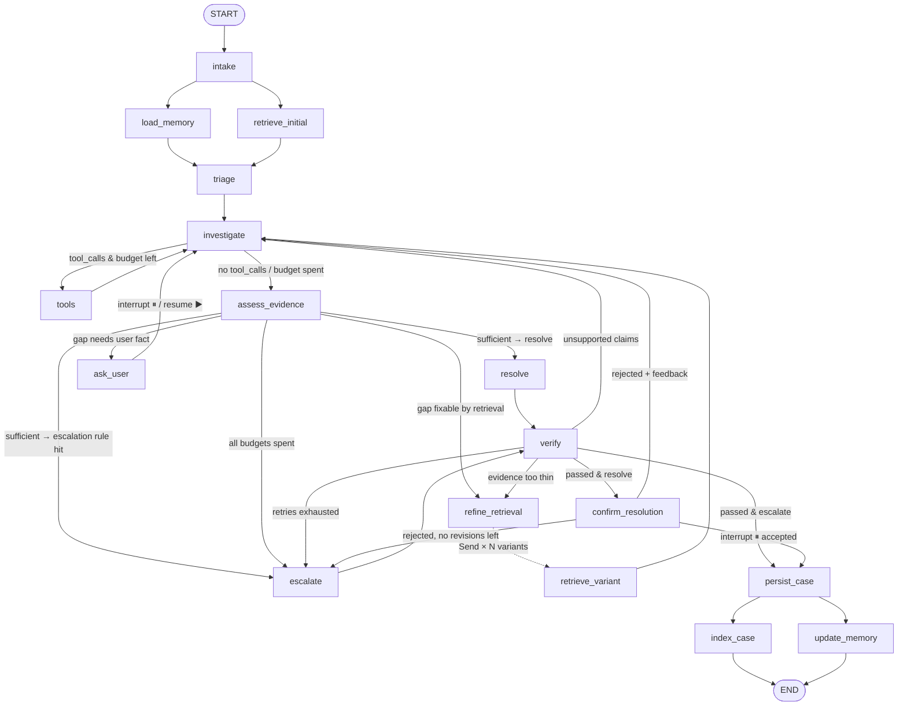

# Graph Design — LangGraph Topology

> **Status:** Draft v1 · decides the node list, edges, loops, interrupts and parallelism.
> **Working assumptions (to be confirmed in `architecture.md`):** Chroma as vector store, SQLite for cases + customer memory, SQLite checkpointer, CLI interface, one cloud LLM with a cheaper model for classification/grading sub-steps.
> **Companion doc:** `state-schema.md` defines every state field referenced here.

---

## 1. Agentic design pattern

**Pattern: a deterministic lifecycle state machine wrapped around an agentic investigation core.**

| Layer | Pattern | Why it fits this problem |
|---|---|---|
| Outer lifecycle (intake → persist → index) | Fixed workflow edges | The brief requires that every ticket is persisted as an open case, that final cases are persisted and indexed, and that output is verified. These steps must **always** run, so they can't be left to the model. |
| Investigation | **ReAct tool loop** (`investigate` ⇄ `tools`) | The brief says the model must decide when a tool is needed, not run a hard-coded sequence. The model picks tools and arguments freely within a bounded budget. |
| Evidence handling | **Corrective RAG** (`assess_evidence` grades the evidence, then routes to re-retrieval, clarification or resolution) | Satisfies "compare evidence across cases, reason about conflicts/insufficiency" and "follow-up/targeted retrieval after forming a hypothesis." |
| Pre-commit check | **Reflection / self-critique** (`verify`) | Satisfies "evidence-check step; if unsupported, retrieve/investigate again." |
| Human input | **Human-in-the-loop via `interrupt()`** | Clarification when evidence is insufficient or conflicting, and acceptance of the final resolution ("accepted/final resolution"). |

**Rejected alternatives**
- *Single prebuilt ReAct agent (`create_react_agent`)*: it can't guarantee persistence, verification or indexing, and the graph design would be mostly invisible, which matters because the graph is part of what's assessed.
- *Supervisor with multiple sub-agents*: there's one domain and one ticket at a time. Multiple agents would add coordination overhead without adding any capability.
- *Plan-and-execute*: tickets are short. A written plan would add a model call per ticket without changing what gets retrieved.

---

## 2. Topology



`escalate` can be reached from three places: `assess_evidence`, `verify` and `confirm_resolution`. The routers never send a run back into `escalate` once `decision == "escalate"` and `verify` has passed (see §4).

---

## 3. Nodes

| # | Node | Purpose | LLM? | Skill loaded | Reads | Writes |
|---|---|---|---|---|---|---|
| 1 | `intake` | Validate the ticket, mirror `config.thread_id` into state, **write the open case to SQLite immediately**, and seed `messages` with the ticket. `ticket_id` is generated by `service.new_ticket()` before the graph is invoked, not here — see case-persistence.md §6. | No | — | `ticket`, `customer_id`, `ticket_id` | `thread_id`, `status="open"`, `messages` |
| 2 | `load_memory` | Load the customer's long-term memory profile, plus their open and recent cases as history. | No | — | `customer_id` | `customer_profile`, `customer_history` |
| 3 | `retrieve_initial` | Broad semantic search over the whole index (top-k=10, no metadata filters). Runs in parallel with #2. | No | — | `ticket` | `retrieved_cases`, `retrieval_queries`, `retrieval_round=1` |
| 4 | `triage` | Classify queue, type, priority and tags using the ticket, the metadata distribution of the neighbour cases and customer memory, then pick the active skills. | Cheap model | `triage` | `ticket`, `retrieved_cases`, `customer_profile` | `classification`, `active_skills`, `status="investigating"` |
| 5 | `investigate` | ReAct step: form or revise a hypothesis and decide whether to call tools. Tools are bound to the model. | Main model | `investigation` (+ domain hints from triage) | everything read-side | `messages` (AIMessage with or without tool_calls), `hypothesis`, `evidence` |
| 6 | `tools` | `ToolNode` that runs the tool calls requested in the last AIMessage. It runs several calls from one message in parallel. | No | — | last `AIMessage` | `messages` (ToolMessages), `tool_log`, `tool_calls_this_round` |
| 7 | `assess_evidence` | Grade the evidence in two stages: rule-based metrics first (counts, similarity, cluster agreement), then a cheap-model judgement on conflicts and missing slots. Decides `next_action`. If the next step is a clarification, it **also generates the question here** (see §6). | Cheap model | — | `retrieved_cases`, `hypothesis`, `evidence`, counters | `evidence_assessment`, `pending_question`, `decision` |
| 8 | `refine_retrieval` | Build 2–3 targeted query variants from the hypothesis and gaps, then fan out with `Send`. | Cheap model | — | `hypothesis`, `evidence_assessment`, `classification` | `retrieval_round += 1`, resets `tool_calls_this_round` |
| 9 | `retrieve_variant` | Run one query variant (with metadata filters). Receives a `Send` payload. | No | — | `Send` payload | `retrieved_cases` (merged by reducer), `retrieval_queries` |
| 10 | `ask_user` | **`interrupt()` #1**: pause with `pending_question` and write the user's answer into the conversation on resume. | No | — | `pending_question` | `clarifications`, `messages`, `clarification_count += 1`, `pending_question=None` |
| 11 | `resolve` | Draft a grounded resolution in which every recommendation cites case IDs. | Main model | `customer_response` | evidence, classification, customer_profile | `draft`, `decision="resolve"` |
| 12 | `escalate` | Draft an escalation: target queue, reason, a summary for the human agent, and a holding reply to the customer. Also computes `escalation.trigger` from state (`output-schema.md` §2.1). | Main model | `escalation` | evidence, classification, `evidence_assessment` | `draft`, `decision="escalate"` |
| 13 | `verify` | **In-graph** evidence check, not the LangSmith evaluation. It checks each claim in the draft against the cited cases, then checks citations exist and schema validity, and computes `confidence` deterministically from the evidence (`output-schema.md` §4) — `resolve`/`escalate` never write it. The model-graded part checks whether the draft's wording matches the computed confidence band. | Cheap model + rules | — | `draft`, `retrieved_cases` | `verification`, `confidence`, `verify_attempts += 1` |
| 14 | `confirm_resolution` | **`interrupt()` #2**: show the verified resolution and ask the user to accept, or reject with feedback. | No | — | `draft` | `user_acceptance`, `user_feedback`, `revision_count` |
| 15 | `persist_case` | Build `final_output` and write the final case record (resolved or escalated) to SQLite. | No | — | all | `final_output`, `status` |
| 16 | `update_memory` | Apply the long-term memory write policy (defined in `memory-design.md`) and upsert the customer profile. Runs in parallel with #17. | Cheap model | — | `final_output`, `clarifications`, `customer_profile` | — (external write only) |
| 17 | `index_case` | Embed an **accepted resolved** case and upsert it into Chroma with `source="agent_resolved"`. Escalated or rejected cases are not indexed. | No (embedding only) | — | `final_output`, `user_acceptance` | — (external write only) |

**Skill loading rule (summary; full detail in `tools-and-skills.md`):** each LLM node has a fixed default skill, shown in the table above. `triage` can add optional domain skills to `active_skills`, such as a `billing` or `security_incident` addendum, and `investigate` loads those. Skills are never all concatenated into one system prompt.

---

## 4. Edges

### 4.1 Static edges

| From | To | Notes |
|---|---|---|
| `START` | `intake` | |
| `intake` | `load_memory`, `retrieve_initial` | **Fan-out**: both run in the same superstep |
| `load_memory`, `retrieve_initial` | `triage` | **Fan-in**: `triage` waits for both |
| `triage` | `investigate` | Always investigate; even a likely escalation needs evidence behind the reason |
| `tools` | `investigate` | Inner ReAct loop |
| `retrieve_variant` | `investigate` | Runs once after all `Send`s in the superstep finish |
| `ask_user` | `investigate` | After the resume |
| `resolve`, `escalate` | `verify` | |
| `persist_case` | `index_case`, `update_memory` | **Fan-out** |
| `index_case`, `update_memory` | `END` | |

### 4.2 Conditional edges

#### `route_after_investigate` (source: `investigate`)
```python
def route_after_investigate(state, config) -> Literal["tools", "assess_evidence"]:
    last = state["messages"][-1]
    budget = config["configurable"]["max_tool_calls_per_round"]      # default 6
    if getattr(last, "tool_calls", None) and state["tool_calls_this_round"] < budget:
        return "tools"
    return "assess_evidence"
```

#### `route_after_assess` (source: `assess_evidence`)
`assess_evidence` fills in `evidence_assessment.next_action`, and the router reads it directly. The decision logic inside the node runs in this order:

```text
1. if verdict == "sufficient":
       if escalation_rule_hit(state):            → "escalate"
       else:                                     → "resolve"
2. if verdict in {"insufficient", "conflicting"}:
       if gap_is_retrievable and retrieval_round < MAX_RETRIEVAL_ROUNDS:
                                                 → "refine_retrieval"
       elif missing_slots and clarification_count < MAX_CLARIFICATIONS:
                                                 → "ask_user"
       else:                                     → "escalate"
```

**Why retrieval comes before asking the user:** re-retrieval is cheap and asks nothing of the customer. The agent asks the user only for a fact that no amount of retrieval could supply, such as their product version or the exact error text.

**`escalation_rule_hit`**: true if any of these hold:
- `classification.priority == "critical"` *and* the tags or type point to security, data loss, an outage or legal matters.
- ≥ 60 % of the supporting historical cases in the dominant cluster were themselves resolved by escalation or handoff.
- The hypothesis requires an action the agent can't take, such as a refund, an account change or an on-site visit.
- `customer_profile.flags` contains an escalation preference, such as `"vip"` or `"repeat_unresolved"`.

#### `route_after_verify` (source: `verify`)
```text
if verification.passed:
    return "confirm_resolution" if decision == "resolve" else "persist_case"
if verify_attempts >= MAX_VERIFY_RETRIES:
    if decision == "resolve":  return "escalate"          # fall back to a human
    else:                      return "persist_case"      # escalation with a caveat flagged
match verification.recommended_action:
    "re_reason"   → "investigate"        # claims outran the evidence
    "re_retrieve" → "refine_retrieval"   # evidence itself too thin (only if retrieval_round < max)
```

#### `route_after_confirm` (source: `confirm_resolution`)
```text
accepted                                      → "persist_case"
rejected and revision_count < MAX_REVISIONS   → "investigate"   (feedback appended to messages)
rejected otherwise                            → "escalate"
```

---

## 5. What counts as "enough" and "conflicting" evidence

`assess_evidence` uses these operational definitions. `τ_rel` is calibrated against the real dataset's measured random-pair similarity distribution — full derivation in `rag-design.md` §9.

| Term | Definition |
|---|---|
| **Relevant case** | A retrieved case with cosine similarity ≥ `τ_rel` (default 0.76 — the measured random-pair p95, `rag-design.md` §9) to the current query. |
| **Approach cluster** | The cheap model groups the historical *answers* of the relevant cases into distinct resolution approaches. Example: "reset credentials", "clear cache + reinstall", "billing adjustment". Each cluster records its `case_ids`. |
| **Dominant share** | The size of the largest cluster divided by the number of relevant cases. |
| **Sufficient** | ≥ 3 relevant cases **and** a dominant share ≥ 0.6 **and** a hypothesis supported by ≥ 2 cases in the dominant cluster **and** no `missing_slots` that would change the approach. |
| **Conflicting** | ≥ 2 clusters each with ≥ 2 cases and a dominant share < 0.6, **or** the neighbours disagree on queue (top queue share < 0.5), **or** the customer's own history contradicts the dominant approach (for example, they already tried it on an earlier ticket). |
| **Insufficient** | Fewer than 3 relevant cases, **or** top similarity < `τ_rel`, **or** the hypothesis has fewer than 2 supporting cases. |
| **Gap is retrievable** | The gap can be expressed as a better query: a narrower metadata filter (queue, type or tags), a rewrite of the hypothesis, or keywords taken from a clarification answer. |
| **Missing slot** | A discriminating fact that the clusters split on and that isn't in the ticket or memory, such as product or version, error message, OS, or plan tier. Only the user can supply it. |

---

## 6. Loops and retry paths

Every loop has a counter in state and a limit in config. When a limit is reached, the run is routed to `escalate`, so the graph always terminates. `recursion_limit = 60` is a final backstop.

| Loop | Path | Counter (state) | Limit (config default) | On exhaustion |
|---|---|---|---|---|
| **A: tool loop** (inner) | `investigate ⇄ tools` | `tool_calls_this_round` | `max_tool_calls_per_round = 6` | → `assess_evidence` |
| **B: corrective retrieval** (the main meaningful loop) | `assess_evidence → refine_retrieval → retrieve_variant → investigate → assess_evidence` | `retrieval_round` | `max_retrieval_rounds = 3` (initial + 2 refinements) | → `ask_user` or `escalate` |
| **C: clarification** | `assess_evidence → ask_user ⏸ → investigate → …` | `clarification_count` | `max_clarifications = 2` | → `escalate` |
| **D: verification retry** | `verify → investigate` or `verify → refine_retrieval` | `verify_attempts` | `max_verify_retries = 2` | resolve → `escalate`; escalate → `persist_case` flagged |
| **E: user rejection** | `confirm_resolution ⏸ → investigate` | `revision_count` | `max_revisions = 1` | → `escalate` |

**Decision:** yes, `verify → investigate` is a second meaningful loop (D), separate from the retrieval loop (B). Loop B fixes *missing evidence*. Loop D fixes *claims that outran the evidence*. D can hand off to B when the verifier says the evidence itself is too thin.

`tool_calls_this_round` is reset to 0 whenever a new round starts, i.e. when `refine_retrieval`, `ask_user` or `verify` routes back into `investigate`.

---

## 7. Interrupts: where `interrupt()` fires and what is frozen

The graph has two interrupt points, both implemented with `langgraph.types.interrupt()` inside a node (not with static `interrupt_before`), and both resumed with `Command(resume=...)`.

### 7.1 `ask_user`: clarification
```python
def ask_user(state: AgentState) -> dict:
    answer = interrupt({
        "type": "clarification",
        "ticket_id": state["ticket_id"],
        "question": state["pending_question"],
        "missing_slots": state["evidence_assessment"].missing_slots,
    })
    return {
        "clarifications": [ClarificationTurn(question=state["pending_question"], answer=answer["answer"])],
        "messages": [HumanMessage(content=answer["answer"], name="customer")],
        "clarification_count": state["clarification_count"] + 1,
        "pending_question": None,
        "tool_calls_this_round": 0,
        "status": "investigating",
    }
```

### 7.2 `confirm_resolution`: acceptance
Payload: `{"type": "confirmation", "ticket_id", "resolution", "confidence": {"value", "band"}, "cited_case_ids"}`.
`cited_case_ids` is derived from `resolution` by the citation regex (`output-schema.md` §3.4), not stored separately.
Resume value: `{"accepted": true}` or `{"accepted": false, "feedback": "..."}`.

### 7.3 Idempotency rule (important)
When a run resumes, LangGraph **re-executes the interrupted node from the top**, so anything before `interrupt()` runs twice. Therefore:
- The clarification question is generated in **`assess_evidence`** and stored in `pending_question`. `ask_user` only calls `interrupt()`, so no LLM call is repeated and the question the user sees doesn't change between the pause and the resume.
- Interrupt nodes contain no side effects: no DB writes and no tool calls.
- `intake` is the only node that writes the open case. It runs before any interrupt, so a resume never re-runs it.

### 7.4 What is frozen and how the run resumes
- At the interrupt, the checkpointer (SQLite, see `state-schema.md` §4) holds the **entire `AgentState`**: messages, retrieved cases, hypothesis, counters, pending question. It also holds the pending task. Nothing is lost if the CLI process exits.
- `status` is set to `"awaiting_user"` in the node that routes into the interrupt, and the `cases` table in SQLite is updated so `autosupport list --awaiting` can find tickets that are waiting on an answer.
- To resume:
  ```python
  config = {"configurable": {"thread_id": thread_id}}
  graph.invoke(Command(resume={"answer": "It's version 4.2 on Windows"}), config)
  ```
- To inspect a waiting run: `graph.get_state(config)` shows `.next == ("ask_user",)` and exposes the interrupt payload via `.interrupts`.

### 7.5 CLI flow (illustrative)
```text
$ autosupport new --customer C-1042 --subject "Sync fails" --body "..."
⏸  T-20260924-7f3a needs clarification: "Which app version are you on, and what error text do you see?"
$ autosupport resume T-20260924-7f3a --answer "v4.2, 'Token expired'"
⏸  T-20260924-7f3a proposed resolution (confidence 0.82). Accept? [y / n + feedback]
$ autosupport resume T-20260924-7f3a --accept
✔  Resolved · persisted · indexed as agent_resolved
```

---

## 8. Parallel execution (decided now)

| Where | Mechanism | What runs concurrently | Why it's worth it |
|---|---|---|---|
| After `intake` | Static fan-out / fan-in edges | `load_memory` ∥ `retrieve_initial` | They're independent I/O. `triage` needs both, and running them together cuts latency. |
| `refine_retrieval` | `Send("retrieve_variant", payload)` × 2–3 | e.g. (a) the hypothesis rewritten as a query, (b) the original query filtered by queue, (c) a query filtered by tags or keywords taken from the clarification | Multi-query retrieval gives broader evidence in a single round. The `merge_cases` reducer deduplicates the results (`state-schema.md` §3). |
| `tools` | `ToolNode` built-in | Several tool calls emitted in one AIMessage, e.g. `get_ticket_by_id` ×3 or `search_similar_tickets` + `compute_queue_stats` | This is free once tools are bound. |
| After `persist_case` | Static fan-out | `index_case` ∥ `update_memory` | They're independent writes. |

Every state key written by concurrent nodes has a reducer. Without one, LangGraph raises `InvalidUpdateError` when two branches write the same key in one superstep.

---

## 9. Run configuration (`config["configurable"]`)

| Key | Default | Used by |
|---|---|---|
| `thread_id` | `"{customer_id}:{ticket_id}"` | checkpointer |
| `max_tool_calls_per_round` | 6 | `route_after_investigate` |
| `max_retrieval_rounds` | 3 | `assess_evidence`, `route_after_verify` |
| `max_clarifications` | 2 | `assess_evidence` |
| `max_verify_retries` | 2 | `route_after_verify` |
| `max_revisions` | 1 | `route_after_confirm` |
| `tau_rel` | 0.76 | `assess_evidence` |
| `require_acceptance` | `true` | `route_after_verify`. When `false`, a passed resolution skips `confirm_resolution`, which is useful for batch LangSmith eval runs. |
| `recursion_limit` | 60 | LangGraph |

---

## 10. Deferred to other docs
- Tool signatures and which node binds which tool → `tools-and-skills.md`
- The long-term memory write policy used by `update_memory` → `memory-design.md`
- Embedding model, query-variant construction and re-ranking → `rag-design.md`
- The final `CaseResult` schema, the confidence formula and scale, and the evidence entry format → `output-schema.md`.
- LangSmith evaluators, which are different from the `verify` node → `evaluation-design.md`
